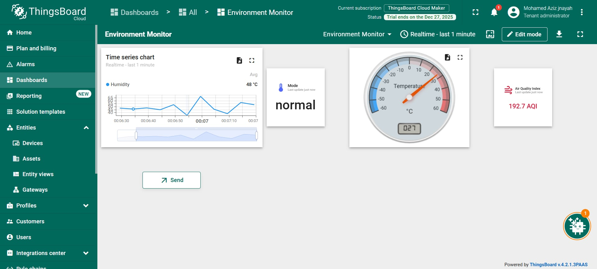

# 🚀 Demo IoT — Capteur Virtuel & ThingsBoard Cloud

> **Simulation d’un flux IoT moderne : Télémétrie ➜ Visualisation Dashboard ➜ Commande RPC ➜ Réaction dynamique**

---

<div align="center">



<sup>Capteur virtuel ➞ Cloud (MQTT) ➞ Dashboard ➞ Commande RPC ➞ Capteur mis à jour</sup>
</div>

---

## ✨ Vue d’ensemble

Cette démo pédagogique illustre un **mini-système IoT bout-en-bout** reposant sur [ThingsBoard Cloud](https://thingsboard.cloud) et un capteur virtuel Python.  
🎯 **Objectifs** :

- **Production & publication de données simulées** : température, humidité, qualité d’air, mode
- **Visualisation en temps réel** sur un dashboard personnalisable
- **Contrôle distant** du capteur grâce à une commande RPC

**Cycle complet visuel** :

```
(Simulateur Python) ──MQTT──▶ 🟦 ThingsBoard Cloud 🟦 ──▶ Dashboard
     ▲                                      │
     └─────────────◀─────── Commande RPC (setState) ──────────┘
```

---

## 🗂️ Structure du projet (partie ThingsBoard)

```tree
project-root/
├── README.md
├── virtual_sensor.py
└── images/
    ├── dashboard.jpeg
    └── rpc_button.png
```

- **virtual_sensor.py** — Script principal du capteur virtuel (Python)
- **images/** — Illustrations de l’interface utilisateur

---

## 🏗️ Architecture du système (ThingsBoard)

```
┏━━━━━━━━━━━━━━━━━━━━┓
┃  Capteur Virtuel   ┃
┃   (Python, MQTT)   ┃
┗━━━━━━━━┯━━━━━━━━━━━┛
         │
         ▼
🟦 ThingsBoard Cloud
    ┃  Device + Token
    ┃  Dashboard
    ┃  RPC (downlink)
    ▼
Visualisation & Contrôle
```

---

## ⚡ 1. Prérequis (ThingsBoard)

- **Python** ⩾ 3.8
- Installer la dépendance MQTT :

  ```bash
  pip install paho-mqtt
  ```

- Créer un compte sur [ThingsBoard Cloud](https://thingsboard.cloud) (gratuit).

---

## 🛠️ 2. Déploiement ThingsBoard

### 2.1. Créer l’appareil virtuel

- Devices ➔ Add new device
- **Nom** : `virtual-env-sensor`
- **Type** : `default`

### 2.2. Obtenir l’access token

- Fiche appareil ➔ Onglet *Credentials*
- Copier le token et le renseigner dans le script Python :

  ```python
  ACCESS_TOKEN = "VOTRE_TOKEN_ICI"
  ```

### 2.3. Créer & personnaliser le dashboard

Ajouter par exemple les widgets suivants :
- 📉 **Graphique séries temporelles** : humidité
- 🌡️ **Jauge** : température
- 🏷️ **Carte numérique** : air_quality
- 📝 **Carte texte** : mode
- 🟢 **Bouton RPC** :
  - Type : *Send RPC*
  - Méthod : `setState`
  - Params : `"eco"` ou `"normal"`

---

## 💻 3. Capteur virtuel (script Python)

Ce script :

- Génère temperature, humidity, air_quality toutes les 5s,
- Publie vers ThingsBoard Cloud (*telemetry*),
- Écoute des commandes RPC `setState` pour changer de mode (normal / eco).

<details>
  <summary><strong>Voir le code complet du capteur virtuel</strong></summary>

```python
import paho.mqtt.client as mqtt
import time
import json
import random

ACCESS_TOKEN = "................"  # <-- Mettre ici votre token

broker = "mqtt.thingsboard.cloud"
port = 1883

client = mqtt.Client()
client.username_pw_set(ACCESS_TOKEN)

# Mode courant du capteur
mode = "normal"

# --------- Callback RPC (commande descendante) ---------
def on_message(client, userdata, msg):
    global mode

    data = json.loads(msg.payload.decode())
    method = data.get("method")
    params = data.get("params")

    print("\n📡 RPC reçu !")
    print("➡️ Méthode  :", method)
    print("➡️ Paramètre:", params)

    if method == "setState":
        mode = params
        print("🔄 Nouveau mode :", mode)

        # Réponse RPC (optionnelle)
        response = {"updatedMode": mode}
        client.publish(msg.topic.replace("request", "response"), json.dumps(response))
        print("📬 RPC réponse envoyée :", response)

client.on_message = on_message

# Connexion au broker ThingsBoard
client.connect(broker, port, keepalive=60)

# Abonnement aux RPC
client.subscribe("v1/devices/me/rpc/request/+")
client.loop_start()

print("🟢 Capteur virtuel ThingsBoard démarré...\n")

# --------- Boucle d'envoi de télémétrie ---------
while True:
    # Génération de données simulées
    if mode == "eco":
        temperature = round(random.uniform(20, 26), 2)
    else:
        temperature = round(random.uniform(25, 32), 2)

    humidity = round(random.uniform(30, 70), 2)
    air_quality = round(random.uniform(0, 200), 2)

    payload = {
        "temperature": temperature,
        "humidity": humidity,
        "air_quality": air_quality,
        "mode": mode,
    }

    # Envoi vers ThingsBoard
    client.publish("v1/devices/me/telemetry", json.dumps(payload))
    print("📤 Données envoyées :", payload)

    time.sleep(5)
```
</details>

---

## 🌍 [Bonus] Edge Demo — EdgeX Foundry & Dashboard Streamlit

En complément du cloud (ThingsBoard), ce projet propose une démo edge computing basée sur :

- **EdgeX Foundry** (stack microservices IoT edge)
- Un **device virtuel** (JSON via device-rest)
- Un **dashboard web Python/Streamlit** interrogeant l’API EdgeX en temps réel.

### 🗂️ Contenu spécifique EdgeX

```tree
project-root/
├── edgex_virtual_sensor.py      # Capteur virtuel : mesures → EdgeX
├── dashboard_edgex.py           # Dashboard Streamlit temps réel
└── README.md
```

- **edgex_virtual_sensor.py** : envoie temperature, humidity, air_quality vers EdgeX via service device-rest.
- **dashboard_edgex.py** : récupère les events de core-data, dashboard en temps réel.

---

### 🧱 Architecture EdgeX simplifiée

```
┏━━━━━━━━━━━━━━━━━━━━┓    HTTP REST (JSON)    ┏━━━━━━━━━━━━━━━━━━━━━━┓
┃  Capteur virtuel   ┃ ───────────────────▶   ┃  EdgeX device-rest   ┃
┃  (Python script)   ┃                        ┗━━━━━━┯━━━━━━━━━━━━━━┛
┗━━━━━━━━━━━━━━━━━━━━┛                               │
                                                     ▼
                                               Core Data (events)
                                                     │
                                                     ▼
                                    Dashboard Streamlit (PC)
```

### ⚙️ Prérequis EdgeX

- Stack EdgeX en Docker (voir [docs officielles](https://www.edgexfoundry.org))
  - core-data, core-metadata, device-rest, edgex-ui-go *(optionnel)*
- Python ⩾ 3.8
- Dépendances :

  ```bash
  pip install requests pandas streamlit streamlit-autorefresh
  ```

- Un device EdgeX configuré :
  - DeviceService : `device-rest`
  - DeviceProfile : profil JSON (une ressource json)
  - Device : `virtual-json-device`

---

### 🛰️ 1. Capteur virtuel EdgeX (`edgex_virtual_sensor.py`)

- Génére périodiquement :
  ```json
  {"temperature": ..., "humidity": ..., "air_quality": ...}
  ```
- Envoie ce JSON à EdgeX via le service device-rest en HTTP POST.
  - URL typique : `http://localhost:59886/api/v3/resource/virtual-json-device/json`

---

### 📊 2. Dashboard EdgeX (`dashboard_edgex.py`)

- Interroge périodiquement l’API `core-data` :
  ```
  GET http://localhost:59880/api/v3/event/device/name/virtual-json-device?limit=50
  ```
- Extrait temperature, humidity, air_quality
- Affiche : dernière valeur (KPI), time series, et data brute.

**Lancer le dashboard :**

```bash
streamlit run dashboard_edgex.py
```
*(Se rafraîchit automatiquement toutes les 3s)*

---

## ✅ Synthèse

Ce repository illustre deux architectures :

- **Cloud IoT avec ThingsBoard** :  
  Simulation capteur MQTT ➝ dashboard cloud ➝ RPC descendante.

- **Edge computing avec EdgeX Foundry** :  
  Collecte locale sur une gateway ➝ API REST ➝ dashboard local Streamlit.

Deux approches concrètes « du script Python au flux IoT complet » : génération de données, ingestion, visualisation temps réel, commande à distance.

---
