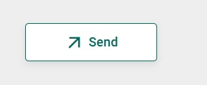

# 🚀 IoT Demo — Capteur Virtuel & ThingsBoard Cloud

> **Simulation d’un flux IoT moderne : Télémétrie → Visualisation Dashboard → Commande RPC → Réaction dynamique**

---

<div align="center">


</div>

---

## ✨ Vue d’ensemble

Cette démo pédagogique apporte une illustration claire et concrète d’un **mini-système IoT bout-à-bout** basé sur [ThingsBoard Cloud](https://thingsboard.cloud) et un capteur virtuel Python.  
Elle combine :

- **Production & émission automatique de données simulées** : température, humidité, AQI, mode
- **Visualisation temps réel** sur dashboard entièrement personnalisable
- **Contrôle à distance** d’un comportement du capteur via un bouton RPC

**Cycle complet :**

```
(Simulateur Python) ── MQTT ──▶ 🟦 ThingsBoard Cloud 🟦 ──▶ Dashboard 🟦
       ▲                                                       │
       └───── <─────────────── Commande RPC (setState) ────────┘
```

---

## 🗂️ Contenu du repository

```
project-root/
├── README.md
├── virtual_sensor.py
└── images/
    ├── dashboard.jpeg
    └── rpc_button.png
```

- `virtual_sensor.py` — Script principal du capteur virtuel (Python)
- `images/` — Illustrations interface utilisateur

---

## 🏗️ Architecture visuelle

```
┏━━━━━━━━━━━━━━━━━━━━┓
┃  Capteur Virtuel   ┃
┃   (Python, MQTT)   ┃
┗━━━━━━━━━━┯━━━━━━━━━┛
           │
           ▼
🟦 ThingsBoard Cloud
  ┃  Device+Token
  ┃  Dashboard
  ┃  RPC (downlink)
  ▼
Visualisation & Contrôle
```

---

## ⚡ 1. Prérequis

- Python **3.8+**
- Installer la dépendance MQTT :
  ```bash
  pip install paho-mqtt
  ```
- Disposer d’un compte [ThingsBoard Cloud](https://thingsboard.cloud)  
  *(création gratuite)*

---

## 🛠️ 2. Déploiement ThingsBoard

### ➤ 2.1. Créer l’appareil

- **Devices > Add new device**
    - *Nom* : `virtual-env-sensor`
    - *Type* : `default`

### ➤ 2.2. Obtenir votre access token

- L’appareil créé, allez dans **Tab "Credentials"**
- Copiez le token et remplacez dans le script :
  ```python
  ACCESS_TOKEN = "VOTRE_TOKEN_ICI"
  ```

### ➤ 2.3. Préparer le dashboard

- Ajoutez les widgets suivants :
  - 📉 **Graphique séries temporelles** : humidité
  - 🌡️ **Jauge** : température
  - 🏷️ **Carte numérique** : air_quality
  - 📝 **Carte texte** : mode
  - 🟢 **Bouton RPC** :
    - `Type` : Send RPC
    - `Méthode` : `setState`
    - `Params` : `"eco"` ou `"normal"`

---

## 💻 3. Capteur virtuel : le script

- **Ce script :**
  - Génère température, humidité, AQI toutes les 5 sec
  - Publie via MQTT sur ThingsBoard Cloud
  - Écoute les commandes RPC `setState` (pour basculer `eco/normal`)

<details>
<summary><strong>Cliquez ici pour voir le code complet</strong></summary>

```python
import paho.mqtt.client as mqtt
import time
import json
import random

ACCESS_TOKEN = "................"  # <-- Mettre ici votre token

broker = "mqtt.thingsboard.cloud"
port = 1883

client = mqtt.Client()
client.username_pw_set(ACCESS_TOKEN)

mode = "normal"

def on_message(client, userdata, msg):
    global mode
    data = json.loads(msg.payload.decode())
    method = data.get("method")
    params = data.get("params")
    print("\n📡 RPC reçu !")
    print("➡️ Méthode :", method)
    print("➡️ Paramètre :", params)
    if method == "setState":
        mode = params
        print("🔄 Nouveau mode :", mode)
        response = {"updatedMode": mode}
        client.publish(msg.topic.replace("request", "response"), json.dumps(response))
        print("📬 RPC réponse envoyée :", response)

client.on_message = on_message
client.connect(broker, port, keepalive=60)
client.subscribe("v1/devices/me/rpc/request/+")
client.loop_start()

print("🟢 Capteur virtuel démarré...\n")

while True:
    temperature = round(random.uniform(20, 32), 2)
    humidity = round(random.uniform(30, 70), 2)
    air_quality = round(random.uniform(0, 200), 2)
    payload = {
        "temperature": temperature,
        "humidity": humidity,
        "air_quality": air_quality,
        "mode": mode
    }
    client.publish("v1/devices/me/telemetry", json.dumps(payload))
    print("📤 Données envoyées :", payload)
    time.sleep(5)
```
</details>

---

## ▶️ 4. Lancement

Lancer le simulateur dans votre terminal :
```bash
python virtual_sensor.py
```

**Exemples de retour :**
```
📤 Données envoyées : {'temperature': 25.3, 'humidity': 65.1, 'air_quality': 88, 'mode': 'normal'}
```
**Lors d’un envoi d’une commande RPC :**
```
📡 RPC reçu !
➡️ Méthode : setState
➡️ Paramètre : eco
🔄 Nouveau mode : eco
📬 RPC réponse envoyée : {'updatedMode': 'eco'}
```

---

## 📊 5. Dashboard : visualisation & contrôle

- **Mise à jour instantanée :**
  - 💧 Humidité → graphe temporel
  - 🌡️ Température → jauge analogique
  - 🏷️ AQI → carte valeur
  - 📝 Mode → carte texte
- **Contrôle en temps réel :**
  - 🟢 Bouton RPC — pour basculer entre *eco* et *normal*

---

## 🖼️ 6. Illustrations

| Dashboard | Bouton RPC |
|:---:|:---:|
|  |  |

---

## ✅ 7. Checklist de validation

- [x] Connexion MQTT opérationnelle
- [x] Télémétrie envoyée toutes les 5s
- [x] Dashboard dynamique en live
- [x] RPC bidirectionnel  ⚡️
- [x] Changement de mode dynamique (eco/normal)

---

## 📦 8. Structure du repo

```
project-root/
├── README.md
├── virtual_sensor.py
└── images/
    ├── dashboard.jpeg
    └── rpc_button.png
```

---

## 🏁 9. Conclusion & utilisations

Ce projet propose une **illustration concrète** et didactique du cycle complet d’un projet IoT moderne :

- **Génération autonome de données**
- **Transmission sécurisée par MQTT**
- **Dashboard personnalisable en cloud**
- **Commande descendante et réaction dynamique sur le device**

> **👨‍💻 Forkez, testez, adaptez pour vos POCs, TP, formation et projets IoT réels !**

---

<div align="right">

<sub>
Un projet par [MohamedAzizJnayah](https://github.com/MohamedAzizJnayah) • 2025
</sub>
</div>
